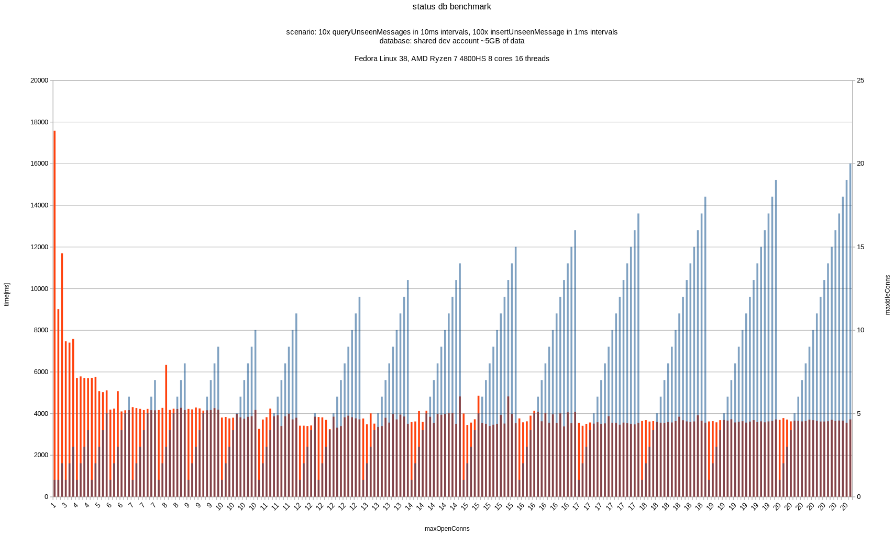

## Description

This project benchmarks status-go's database using various configurations of `maxOpenConns` and `maxIdleConns`.

## Results



## Build&run

```
export DB_PERF_PATH="path_to_status_go_db"
export DB_PERF_KEY="lowercase(keccak256(db_password))"
make run
```

This will generate `output/perf-compare-connections-config-*.csv` file with the benchmark results. The columns in the CSV file represents `maxOpenConns`, `maxIdleConns` and `time` respectively. Additionally, the project produces a `output/perf-*.csv` file that lists each database query's duration for every configuration.
